# El Arte del Desarrollo Indie

Ser un **desarrollador indie** no es solo una elección profesional, es una **filosofía de vida**. En The Holy Code, hemos adoptado esta mentalidad para crear productos que realmente marquen la diferencia.

## ¿Qué Significa Ser Indie?

### Libertad Creativa
Sin las restricciones de grandes corporaciones, podemos:
- Experimentar con tecnologías emergentes
- Tomar decisiones rápidas
- Priorizar la calidad sobre la cantidad
- Mantener una comunicación directa con los clientes

### Responsabilidad Personal
Cada línea de código lleva nuestra firma. No hay departamentos que diluyan la responsabilidad; **somos dueños de cada decisión**.

## Ventajas del Enfoque Indie

### 1. **Agilidad Extrema**

La diferencia entre los enfoques tradicional e indie es abismal:

```typescript
// 🏢 Enfoque Tradicional
function traditionalApproach() {
  const meeting = scheduleStakeholderMeeting();
  const approval = waitForApproval(meeting);
  const implementation = implementAfterWeeks(approval);
  return implementation; // ⏱️ Meses de espera
}

// 🚀 Enfoque Indie
function indieApproach() {
  const idea = captureIdea();
  const prototype = buildImmediately(idea);
  const feedback = getInstantFeedback(prototype);
  return iterateAndImprove(feedback); // ⚡ Días de ejecución
}
```

**Resultado**: Mientras otros planifican, nosotros ya estamos iterando.

### 2. **Innovación Constante**

Sin procesos burocráticos, podemos:

> 🧪 **Experimentación Libre**
> - Probar nuevas arquitecturas sin comités
> - Integrar las últimas tecnologías al instante
> - Experimentar con UX/UI creativas
> - Implementar ideas "locas" que funcionan

```javascript
// Ejemplo: Integración experimental
const experimentalFeature = async () => {
  // En corporaciones: 6 meses de aprobación
  // En indie: ¡Lo probamos hoy!
  
  if (hasPromise()) {
    return await tryNewTechnology();
  }
  
  return innovateOrDie();
};
```

### 3. **Relación Directa con el Cliente**
No hay intermediarios. Hablamos directamente con quien tendrá el producto final.

## Los Retos del Desarrollo Indie

### Gestión de Expectativas
Los clientes a veces esperan equipos masivos. Nosotros ofrecemos algo mejor: **atención personalizada y expertise concentrado**.

### Equilibrio Trabajo-Vida
Ser indie puede significar trabajar más horas, pero también tener **más control sobre cómo y cuándo trabajas**.

### Mantenerse Actualizado
Sin departamentos de investigación, cada desarrollador indie debe ser su propio **radar tecnológico**.

## Herramientas del Indie Moderno

### 🛠️ Stack Tecnológico

| **Categoría** | **Herramientas** | **¿Por qué?** |
|---------------|------------------|---------------|
| **Frontend** | React, Astro, Tailwind CSS | Velocidad + Flexibilidad |
| **Backend** | Node.js, Python, PostgreSQL | Escalabilidad probada |
| **Despliegue** | Vercel, Netlify, Docker | Deploy en segundos |
| **Herramientas** | VS Code, Git, Figma | Flujo de trabajo optimizado |

### 🎯 Metodología Indie

```mermaid
graph TD
    A[💡 Idea] --> B[🚀 Prototipo 24h]
    B --> C[👥 Feedback Cliente]
    C --> D[🔄 Iteración Rápida]
    D --> C
    C --> E[🎉 MVP Listo]
```



1. **Prototipado Rápido**: De idea a MVP en semanas (no meses)
2. **Feedback Continuo**: Cliente involucrado en cada iteración
3. **Mejora Constante**: Nunca dejamos de refinar y optimizar

## Casos de Éxito Indie

### Proyecto Secreto 🤫
Estamos trabajando en algo revolucionario que cambiará cómo las personas interactúan con la tecnología. Pronto más detalles...

### Contribuciones Open Source
Creemos en **devolver a la comunidad**. Varios de nuestros componentes están disponibles en GitHub.

## El Futuro del Desarrollo Indie

La tecnología está democratizando el desarrollo. Herramientas como:
- **AI/ML**: Copilot, ChatGPT para código
- **No-Code/Low-Code**: Para prototipos rápidos
- **Cloud Computing**: Infraestructura accesible
- **Frameworks Modernos**: Desarrollo más eficiente

Permiten que pequeños equipos compitan con grandes corporaciones.

## Consejo para Futuros Indies

1. **Especialízate**: Sé excelente en pocas cosas
2. **Construye en Público**: Comparte tu proceso
3. **Mantén la Curiosidad**: Nunca dejes de aprender
4. **Cultiva Relaciones**: La red es tu mayor activo

## 🎯 Conclusión: El Poder del Indie

En **The Holy Code**, el desarrollo indie no es una limitación, es nuestra **superpoder**. Nos permite:

- ✨ **Crear productos únicos** que realmente importan
- 🤝 **Mantener relaciones genuinas** con nuestros clientes
- 💡 **Disfrutar el proceso creativo** sin restricciones
- 🚀 **Innovar constantemente** sin barreras burocráticas

> 💫 **"El futuro pertenece a los que se atreven a crear sin límites"**

### 🔥 ¿Listo para el Toque Indie?

¿Tienes una idea que necesita el toque indie? [Conversemos](mailto:mauro@holy-code.com) y veamos cómo podemos hacer magia juntos.

---

### 🌟 Conecta con la Comunidad Indie

*¿Eres desarrollador indie o estás considerando dar el salto? Me encantaría conocer tu historia.*

- 💼 **Profesional**: [LinkedIn](https://linkedin.com/in/mesanchez91)
- 🎮 **En vivo**: [Twitch](https://twitch.tv/holycode)
- 📺 **Contenido**: [YouTube](https://youtube.com/@holycode)
- 🐦 **Quick updates**: [X/Twitter](https://x.com/MauroSanchez25)

**¡Únete a la revolución indie!** 🚀