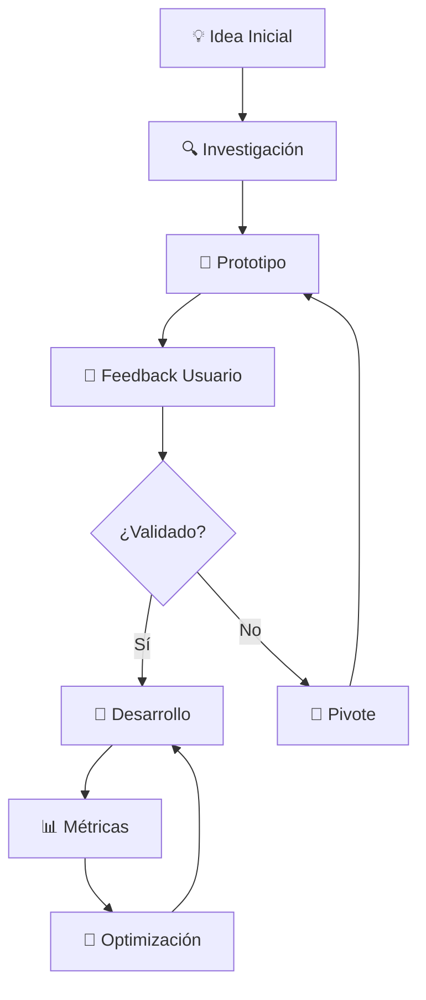

# Transformando Ideas en Productos Digitales

En **The Holy Code**, creemos que cada gran producto digital comenzó como una idea simple. El desafío no está en tener ideas brillantes, sino en **transformarlas en realidad** con una ejecución impecable.

> 💡 **"La distancia entre una idea y un producto exitoso se mide en iteraciones, no en tiempo"**

## 🧭 El Proceso de Transformación

### 1. **🎯 Escucha Activa y Análisis Profundo**

El primer paso es entender profundamente la visión del cliente. No se trata solo de requerimientos técnicos, sino de **captar la esencia** de lo que quieren lograr.

```typescript
// ✅ Enfoque correcto: Análisis completo
const ideaAnalysis = {
  problemStatement: analyzeRealProblem(),
  targetAudience: defineUserPersonas(),
  marketSize: estimateOpportunity(),
  technicalFeasibility: assessComplexity(),
  businessModel: defineRevenue(),
  timeToMarket: calculateTimeline()
};

// ❌ Error común: Solo requerimientos superficiales
const basicRequirements = {
  features: ["login", "dashboard", "payments"],
  deadline: "3 meses",
  budget: "limitado"
};
```

**Preguntas clave que hacemos:**
- ¿Qué problema específico resuelve esto?
- ¿Quién es exactamente tu usuario ideal?
- ¿Cómo miden el éxito actualmente?
- ¿Qué alternativas han probado?

### 2. **🎨 Arquitectura Creativa y Escalable**

Diseñamos la estructura técnica como si fuera una obra de arte. Cada línea de código tiene un propósito, cada componente está pensado para escalar.

```javascript
// Arquitectura modular que crece con el negocio
const productArchitecture = {
  frontend: {
    framework: "React/Astro", // ⚡ Rendimiento
    styling: "Tailwind CSS",  // 🎨 Consistencia
    stateManagement: "Zustand" // 🔄 Simplicidad
  },
  backend: {
    runtime: "Node.js",       // 🚀 Velocidad
    database: "PostgreSQL",   // 📊 Confiabilidad
    api: "GraphQL/REST",      // 🔗 Flexibilidad
    deployment: "Docker"      // 📦 Portabilidad
  },
  infrastructure: {
    hosting: "Vercel/AWS",    // ☁️ Escalabilidad
    monitoring: "Sentry",     // 👀 Observabilidad
    analytics: "Plausible"    // 📈 Privacidad
  }
};
```

### 3. **🔄 Iteración Inteligente y Feedback Continuo**

Trabajamos en ciclos cortos, validando constantemente con el cliente. Esto nos permite **pivotar rápidamente** cuando es necesario.



## 🏆 Casos de Éxito Recientes

### MealMate+ 🍽️ **Nutrición Inteligente**

**El Desafío**: Crear una experiencia personalizada sin ser abrumadora.

**La Solución**: Interfaz intuitiva con algoritmos de recomendación inteligentes.

```typescript
interface NutritionProfile {
  userId: string;
  goals: "weightLoss" | "muscleGain" | "maintenance";
  restrictions: string[];
  preferences: FoodPreference[];
  activityLevel: number;
}

const generateMealPlan = async (profile: NutritionProfile) => {
  // 🧠 AI-powered recommendations
  const recommendations = await aiService.analyze({
    userData: profile,
    nutritionalNeeds: calculateNeeds(profile),
    seasonalAvailability: getCurrentSeason(),
    budgetConstraints: profile.budget
  });
  
  return optimizeMealPlan(recommendations);
};
```

**Resultados obtenidos:**
- ✅ **85%** de retención mensual
- ✅ **3.2x** mejora en adherencia nutricional
- ✅ **92%** satisfacción del usuario

### Kondominios 🏢 **Gestión Inteligente**

**El Desafío**: Digitalizar procesos complejos manteniendo la simplicidad.

**La Solución**: Dashboard centralizado con módulos especializados.

```python
# Sistema modular para gestión de condominios
class CondominiumManagement:
    def __init__(self, building_id):
        self.building = Building(building_id)
        self.modules = {
            'financial': FinancialModule(),
            'maintenance': MaintenanceModule(),
            'communication': CommunicationModule(),
            'security': SecurityModule()
        }
    
    def generate_monthly_report(self):
        # 📊 Consolidación automática de datos
        return {
            'expenses': self.modules['financial'].get_summary(),
            'maintenance': self.modules['maintenance'].get_pending(),
            'occupancy': self.building.get_occupancy_rate(),
            'incidents': self.modules['security'].get_incidents()
        }
```

**Impacto del producto:**
- ✅ **70%** reducción en tiempo administrativo
- ✅ **95%** mejora en transparencia financiera
- ✅ **60%** menos quejas de residentes

## 🛠️ Nuestra Metodología Comprobada

### **Fase 1: Discovery & Estrategia** (1-2 semanas)
```javascript
const discoveryPhase = {
  stakeholderInterviews: "Entender todas las perspectivas",
  competitorAnalysis: "Identificar oportunidades",
  technicalAudit: "Evaluar factibilidad",
  userResearch: "Validar hipótesis iniciales"
};
```

### **Fase 2: Diseño & Prototipado** (2-3 semanas)
- **🎨 Design System**: Componentes reutilizables
- **🖼️ Wireframes**: Estructura funcional
- **🎯 User Flows**: Experiencia optimizada
- **📱 Prototipos**: Validación temprana

### **Fase 3: Desarrollo Ágil** (4-8 semanas)
```typescript
const developmentProcess = {
  methodology: "Scrum adaptado",
  sprintDuration: "1 semana",
  dailyStandups: "Sincronización constante",
  weeklyDemos: "Feedback inmediato",
  continuousDeployment: "Entrega continua"
};
```

### **Fase 4: Lanzamiento & Optimización** (Ongoing)
- **📊 Analytics Setup**: Métricas clave
- **🔍 User Testing**: Validación en producción
- **🚀 Performance Optimization**: Velocidad máxima
- **📈 Growth Hacking**: Escalamiento inteligente

## 🌟 Lo Que Nos Diferencia

### 1. **🤝 Enfoque Humano**
La tecnología debe servir a las personas, no al revés.

### 2. **🎯 Calidad Artesanal**
Cada proyecto recibe atención personalizada y cuidado extremo en los detalles.

### 3. **🔮 Visión a Largo Plazo**
Construimos productos que crecen con el negocio, no soluciones temporales.

### 4. **⚡ Velocidad Inteligente**
Movemos rápido, pero sin romper cosas. Cada decisión está calculada.

### 5. **📊 Decisiones Basadas en Datos**
Cada funcionalidad está respaldada por métricas reales y feedback de usuarios.

## 🚀 Stack Tecnológico de Vanguardia

| **Capa** | **Tecnología** | **Por qué la elegimos** |
|----------|----------------|-------------------------|
| **Frontend** | React, Astro, Next.js | Rendimiento + SEO + DX |
| **Styling** | Tailwind CSS, Styled Components | Consistencia + Velocidad |
| **Backend** | Node.js, Python, Go | Escalabilidad + Flexibilidad |
| **Database** | PostgreSQL, MongoDB | Confiabilidad + Performance |
| **Cloud** | Vercel, AWS, Google Cloud | Disponibilidad + Escala |
| **Monitoring** | Sentry, DataDog | Observabilidad + Alertas |

## 🎯 Metodología de Validación

```javascript
const validationFramework = {
  // 💡 Hipótesis claras
  hypothesis: "Los usuarios necesitan X para lograr Y",
  
  // 📊 Métricas de éxito
  successMetrics: ["retención > 70%", "NPS > 8", "churn < 5%"],
  
  // 🧪 Experimentos controlados
  experiments: [
    "A/B testing de UX",
    "Feature flags para rollout gradual",
    "User interviews semanales"
  ],
  
  // ⏱️ Timeboxing estricto
  timeline: "2 semanas para validar cada hipótesis"
};
```

## 💼 El Futuro es Colaborativo

En **The Holy Code**, no solo desarrollamos productos, **co-creamos el futuro** junto a nuestros clientes. Cada proyecto es una oportunidad de redefinir lo que es posible.

### 🔥 **¿Listo para Transformar tu Idea?**

**No importa si tienes:**
- 🌱 Una startup en etapa temprana
- 🏢 Una empresa establecida buscando innovar
- 💡 Una idea revolucionaria sin validar
- 🔄 Un producto existente que necesita evolucionar

### 📞 **Proceso de Colaboración**

1. **📅 Sesión Discovery Gratuita** (30 min)
2. **📋 Propuesta Técnica Detallada** (48h)
3. **🚀 Kick-off y Primeros Entregables** (Semana 1)
4. **🎯 Iteración Continua** (Hasta lograr el éxito)

¿Tienes una idea que quieres transformar en realidad? [Conversemos](mailto:mauro@holy-code.com) y exploremos las posibilidades juntos.

---

### 🌟 **Próximos Contenidos**

*En próximos posts exploraremos:*

- 🔧 **Casos técnicos específicos** con código real
- 🚀 **Tecnologías emergentes** y cómo las aplicamos
- 📊 **Lecciones aprendidas** de fracasos y éxitos
- 🎯 **Métricas que realmente importan** en productos digitales

**¡Mantente conectado para contenido exclusivo sobre desarrollo de productos!** 🚀 